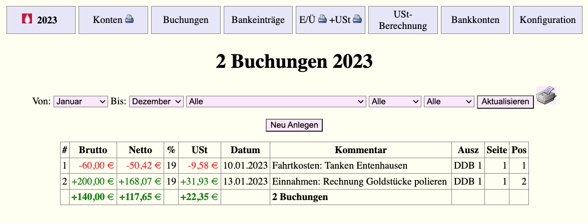

# ust

ust - J2EE-Studie E/Ü- und USt-Berechnung

Zum Hintergrund siehe https://www.consulting.heikol.de/ust.html



## Docker Container

There is a Docker environment prepared with minimalistic test data. You can create your own instance with the following commands:
```
git clone https://github.com/muhme/ust
cd ust
scripts/build.sh
```
Then you have a test instance running on http://localhost:8080/ust.
Container directory `/usr/local/tomcat/webapps/ust/data` is mapped to host directory `data`.

### Timezone Configuration

- The container honors the `TZ` environment variable and sets the JVM timezone via `JAVA_OPTS=-Duser.timezone=...`.
- Recommended: export your timezone and let compose pass it through.
  ```bash
  export TZ=Europe/Berlin
  scripts/build.sh
  ```

<details>
  <summary>👉 There are also development hints.</summary>

---

## Developer Hints

### Java Documentation

See JavaDoc in folder doc.

### Code Checker

You can use the following script to check code style:
```bash
scripts/lint.sh
```

### Tests
Lightweight regression tests can be compiled and run without JUnit inside Docker container:
  ```bash
  export TZ=Europe/Berlin
  scripts/test-in-docker.sh
  ```

### Legacy Build
The [build](build) file is only for legacy build command.

### Clean-Up
To stop and remove Docker container and network:
```bash
scripts/clean.sh
```

---

</details>

## Trouble-Shouting
* **Duplicate Bookings in the List:**
  Bookings with unique IDs were displayed multiple times in the booking list.
  * 👉 Stop Tomcat, delete the `cache/work` folder, and restart Tomcat.
* **Exception:** `de.hlu.ust.AppException: Kann keine Buchung mit der bankStatementId 4711 finden!`
  * 👉 Stop tomcat, delete the line with the specified ID (e.g. `4711`) in  the `bankStatements` file and restart Tomcat.

## License
This project is licensed under the MIT License.
