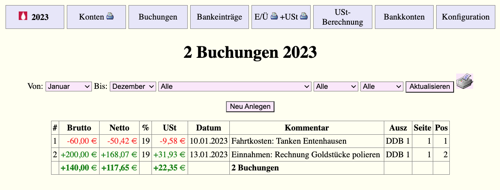

# ust
ust - J2EE-Studie E/Ü- und USt-Berechnung

Zum Hintergrund siehe https://www.consulting.heikol.de/ust.html



## Docker Container
There is a Docker environment prepared with minimalistic test data. You can create your own instance with the following commands:
```
git clone https://github.com/muhme/ust
cd ust
docker compose up -d
```
Then you have a test instance running on http://localhost:8080/ust.
Container directory /usr/local/tomcat/webapps/ust/data is mapped to host directory data.

## Build
You can build an .war archive with you adoption of shell script build.

## Documentation
See JavaDoc in folder doc.

## Clean-Up
To stop and remove Docker containers and networks:
```bash
docker compose down
```

## License
This project is licensed under the MIT License.

